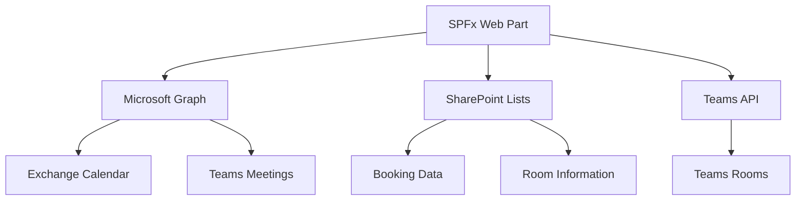

# Meeting Room & Resource Booking Web Part

## Overview

The Meeting Room & Resource Booking web part provides a comprehensive solution for managing meeting rooms, equipment, and resources within your organization. Built with React and Fluent UI, this web part offers seamless integration with Microsoft Teams, advanced booking capabilities, and intelligent resource management to optimize space utilization and enhance meeting experiences.

## Features

### Core Functionality
- **Room Discovery**: Browse and search available meeting rooms with detailed information
- **Real-time Availability**: Live availability checking with conflict detection
- **Booking Management**: Create, modify, and cancel bookings with approval workflows
- **Resource Allocation**: Book additional equipment and resources with room reservations
- **Recurring Bookings**: Support for daily, weekly, monthly, and custom recurrence patterns
- **Conflict Resolution**: Intelligent suggestions for alternative times and rooms

### Teams Integration
- **Automatic Teams Meetings**: Auto-generate Teams meetings for hybrid collaboration
- **Teams Room Integration**: Direct integration with Microsoft Teams Rooms devices
- **Teams Calendar Sync**: Synchronize bookings with Teams and Outlook calendars
- **Hybrid Meeting Support**: Seamless experience for in-person and remote attendees
- **Recording Management**: Access to Teams meeting recordings post-event
- **Phone Dial-in**: Automatic phone bridge setup for global participation

### Advanced Features
- **Smart Suggestions**: AI-powered room recommendations based on meeting requirements
- **Catering Integration**: Order refreshments and catering services
- **Equipment Management**: Reserve AV equipment, furniture, and specialized tools
- **Accessibility Support**: Full accessibility features and accommodation requests
- **Mobile Optimization**: Complete functionality on mobile devices and tablets
- **Analytics Dashboard**: Usage statistics and optimization insights

### User Experience
- **Intuitive Interface**: Modern, responsive design with drag-and-drop scheduling
- **Calendar Views**: Multiple view options including daily, weekly, and monthly layouts
- **Quick Actions**: One-click booking for popular room and time combinations
- **Visual Floor Plans**: Interactive floor plans showing room locations and status
- **Notification System**: Email and Teams notifications for booking confirmations
- **Multi-language Support**: Localization for global organizations

## Setup Instructions

### Prerequisites
- SharePoint Online environment with modern sites
- Microsoft Teams integration capabilities
- SharePoint Framework (SPFx) 1.18.2 or higher
- Node.js 16.x or 18.x
- Microsoft Graph API permissions for calendar and Teams integration

### Required Microsoft Graph Permissions
```json
{
  "permissions": [
    "Calendars.ReadWrite",
    "OnlineMeetings.ReadWrite",
    "User.Read.All",
    "Place.Read.All",
    "Bookings.ReadWrite.All"
  ]
}
```

### Installation Steps

1. **Deploy the Solution**
   ```bash
   npm install
   npm run build
   npm run package-solution
   ```

2. **Upload to App Catalog**
   - Navigate to SharePoint Admin Center
   - Go to More Features > Apps > App Catalog
   - Upload the `.sppkg` file from `sharepoint/solution/`

3. **Grant API Permissions**
   - Go to SharePoint Admin Center > Advanced > API access
   - Approve pending permission requests for Microsoft Graph

4. **Add to SharePoint Site**
   - Go to Site Contents > Add an App
   - Find "Meeting Room & Resource Booking" and add it
   - Add the web part to pages using the web part picker

### Configuration

#### Web Part Properties
Configure the following in the web part property pane:

- **Description**: Customize the web part description
- **Default Location**: Set default building or location filter
- **Enable Teams Integration**: Toggle Teams meeting auto-creation
- **Enable Recurring Bookings**: Allow recurring meeting patterns
- **Maximum Booking Duration**: Set maximum hours per booking
- **Require Approval**: Enable approval workflow for bookings

#### SharePoint List Setup
The web part automatically creates these SharePoint lists:
- **Meeting Rooms**: Room information and capabilities
- **Bookings**: Reservation records and status
- **Equipment**: Available equipment and resources
- **Resources**: Additional bookable resources (vehicles, facilities)
- **Booking Approvals**: Approval workflow tracking
- **Usage Analytics**: Booking statistics and utilization data

#### Teams Integration Setup
1. **Register App in Azure AD**
   ```bash
   # Create app registration for Teams integration
   az ad app create --display-name "Room Booking Teams Integration"
   ```

2. **Configure Microsoft Graph Permissions**
   - Add required Graph API permissions
   - Grant admin consent for organization

3. **Teams App Configuration**
   - Upload Teams app manifest for bot integration
   - Configure Teams app permissions and capabilities

## Usage Examples

### End User Workflows

#### Quick Booking
1. **Select Date and Time**: Choose from calendar view or time slots
2. **Browse Rooms**: View available rooms with capacity and amenities
3. **Book Instantly**: One-click booking for simple meetings
4. **Teams Integration**: Auto-generated Teams meeting link

#### Advanced Booking
1. **Meeting Details**: Enter title, description, and attendee list
2. **Room Requirements**: Specify capacity, equipment, and accessibility needs
3. **Resource Selection**: Add AV equipment, catering, or special setup
4. **Recurring Pattern**: Configure weekly team meetings or training sessions
5. **Approval Submission**: Submit for approval if required by policy

#### Managing Bookings
1. **View My Bookings**: Personal dashboard of upcoming reservations
2. **Modify Bookings**: Change time, attendees, or resources
3. **Cancel Bookings**: Cancel with automatic notifications
4. **Check-in Process**: Confirm attendance and room usage

### Administrative Workflows

#### Room Management
1. **Add New Rooms**: Configure room details, capacity, and amenities
2. **Update Equipment**: Manage available AV and IT equipment
3. **Set Policies**: Configure booking rules and approval requirements
4. **Maintenance Scheduling**: Block rooms for maintenance and cleaning

#### Analytics and Reporting
1. **Utilization Reports**: Track room usage and peak hours
2. **Cost Analysis**: Monitor booking costs and resource utilization
3. **User Behavior**: Analyze booking patterns and preferences
4. **Optimization Insights**: Identify underutilized resources

## Teams Integration

### Automatic Teams Meeting Creation
```typescript
// Example configuration
const teamsConfig = {
  autoCreateMeeting: true,
  includeDialIn: true,
  recordingEnabled: false,
  lobbyBypass: 'organization',
  attendeePermissions: {
    allowMic: true,
    allowCamera: true,
    allowScreenShare: true
  }
};
```

### Teams Room Integration
- **Device Status Monitoring**: Real-time status of Teams Room devices
- **Remote Management**: Configure room settings and troubleshoot issues
- **Content Sharing**: Direct sharing from personal devices to room displays
- **Meeting Controls**: Room-based meeting start/stop and participant management

### Teams App Features
- **Bot Commands**: Book rooms through Teams chat commands
- **Proactive Notifications**: Meeting reminders and room availability alerts
- **Adaptive Cards**: Rich card interfaces for booking confirmations
- **Meeting Integration**: Quick access to room booking during Teams meetings

## Technical Architecture

### Frontend Components
- **MeetingRoomBooking.tsx**: Main component with calendar and booking interface
- **RoomSelector.tsx**: Room browsing and filtering component
- **BookingForm.tsx**: Comprehensive booking creation and editing form
- **CalendarView.tsx**: Multiple calendar view options and scheduling
- **AvailabilityPanel.tsx**: Real-time availability checking and conflicts
- **TeamsIntegration.tsx**: Teams meeting creation and management

### Backend Integration
- **BookingDataService**: SharePoint data operations and business logic
- **TeamsIntegrationService**: Microsoft Graph API integration for Teams
- **CalendarService**: Outlook and Exchange calendar synchronization
- **NotificationService**: Email and Teams notification delivery
- **AnalyticsService**: Usage tracking and reporting functionality
- **ConflictResolutionService**: Intelligent booking conflict handling

### Data Models
- **IMeetingRoom**: Complete room information and capabilities
- **IBooking**: Booking details with status and recurrence patterns
- **IResource**: Equipment and additional resource definitions
- **ITeamsIntegration**: Teams meeting configuration and links
- **IAvailabilitySlot**: Time slot availability and restrictions

### Integration Architecture


## Advanced Features

### Smart Room Recommendations
- **AI-Powered Suggestions**: Machine learning algorithms for optimal room selection
- **Historical Patterns**: Learning from past booking behavior
- **Preference Management**: Personal and team room preferences
- **Capacity Optimization**: Right-sizing rooms for meeting requirements

### Accessibility Features
- **WCAG 2.1 Compliance**: Full accessibility standard compliance
- **Screen Reader Support**: Comprehensive screen reader compatibility
- **Keyboard Navigation**: Complete keyboard-only operation
- **High Contrast Mode**: Enhanced visibility options
- **Voice Commands**: Integration with accessibility tools

### Mobile Experience
- **Progressive Web App**: Install as mobile app for offline access
- **QR Code Check-in**: Quick room check-in via QR codes
- **Location Services**: GPS-based room finding and navigation
- **Push Notifications**: Mobile notifications for booking updates

## Customization Options

### Room Configuration
```typescript
// Custom room types and configurations
const roomTypes = {
  boardroom: {
    capacity: { min: 8, max: 20 },
    equipment: ['projector', 'conference-phone', 'whiteboard'],
    approvalRequired: true
  },
  huddle: {
    capacity: { min: 2, max: 6 },
    equipment: ['tv-display', 'wireless-presentation'],
    approvalRequired: false
  }
};
```

### Booking Policies
- **Time Restrictions**: Configure available hours and blackout periods
- **Advance Booking Limits**: Set maximum advance booking periods
- **Duration Limits**: Define minimum and maximum booking durations
- **User Quotas**: Limit number of concurrent bookings per user
- **Department Priorities**: Priority booking for specific departments

### UI Customization
- **Branding**: Apply organizational colors, logos, and styling
- **Layout Options**: Configure calendar views and room display options
- **Custom Fields**: Add organization-specific booking fields
- **Localization**: Multi-language support and regional settings

## Security and Compliance

### Data Protection
- **Encryption**: Data encryption at rest and in transit
- **Access Control**: Role-based permissions and data access restrictions
- **Audit Logging**: Complete audit trail for all booking activities
- **Privacy Controls**: Personal data protection and GDPR compliance

### Integration Security
- **OAuth 2.0**: Secure authentication with Microsoft Graph
- **Certificate-Based Auth**: Enhanced security for service accounts
- **API Rate Limiting**: Protection against API abuse
- **Token Management**: Secure token storage and refresh mechanisms

### Compliance Features
- **Retention Policies**: Automated data retention and deletion
- **Export Capabilities**: Data export for compliance reporting
- **Access Reports**: User access and activity reporting
- **Regulatory Controls**: Industry-specific compliance features

## Performance Optimization

### Caching Strategy
- **Browser Caching**: Client-side caching for room and resource data
- **API Response Caching**: Optimized Microsoft Graph API usage
- **Image Optimization**: Compressed room images and floor plans
- **Lazy Loading**: On-demand loading of non-critical components

### Scalability Considerations
- **Load Balancing**: Distributed processing for high-volume organizations
- **Database Optimization**: Efficient queries and indexing strategies
- **CDN Integration**: Global content delivery for international organizations
- **Background Processing**: Async operations for resource-intensive tasks

## Integration Scenarios

### Enterprise Systems
- **ERP Integration**: Connect to enterprise resource planning systems
- **ITSM Integration**: ServiceNow and other IT service management tools
- **Facilities Management**: Integration with building management systems
- **Directory Services**: LDAP and Active Directory synchronization

### Third-Party Services
- **Catering Services**: External catering and food service providers
- **Security Systems**: Badge access and security clearance verification
- **Environmental Controls**: HVAC and lighting system integration
- **Visitor Management**: Visitor registration and tracking systems

### API Endpoints
```typescript
// Example REST API endpoints
const apiEndpoints = {
  rooms: '/api/rooms',
  bookings: '/api/bookings',
  availability: '/api/availability/{roomId}/{date}',
  teams: '/api/teams/meeting',
  analytics: '/api/analytics/utilization'
};
```

## Troubleshooting

### Common Issues
1. **Teams Integration Failures**
   - Verify Microsoft Graph permissions
   - Check Azure AD app registration
   - Validate Teams service availability

2. **Calendar Sync Problems**
   - Review Exchange Web Services connectivity
   - Check user mailbox permissions
   - Verify calendar delegation settings

3. **Performance Issues**
   - Monitor SharePoint list thresholds
   - Review API rate limiting
   - Check network connectivity

### Debugging Tools
- **Graph Explorer**: Test Microsoft Graph API calls
- **SPFx Debug Mode**: Detailed logging and error information
- **Network Monitor**: Track API calls and response times
- **Usage Analytics**: Monitor web part performance metrics

### Support Resources
- Microsoft Graph API documentation
- Teams development platform guides
- SharePoint Framework troubleshooting
- Microsoft 365 admin center diagnostic tools

## Future Enhancements

### Planned Features
- **AR/VR Integration**: Virtual room tours and augmented reality navigation
- **IoT Sensors**: Real-time occupancy and environmental monitoring
- **AI Assistant**: Voice-activated booking and room management
- **Blockchain Integration**: Decentralized booking verification and smart contracts

### Technology Roadmap
- Q2 2024: Enhanced mobile app with offline capabilities
- Q3 2024: AI-powered predictive analytics and optimization
- Q4 2024: IoT sensor integration for smart building features
- Q1 2025: AR navigation and virtual meeting spaces

### Integration Expansions
- **Microsoft Viva**: Integration with employee experience platform
- **Power Platform**: Enhanced workflow automation and analytics
- **Azure Digital Twins**: Building modeling and simulation
- **Mixed Reality**: HoloLens integration for immersive experiences

## Cost Considerations

### Licensing Requirements
- SharePoint Online licensing for all users
- Microsoft Teams licensing for integration features
- Microsoft Graph API usage within service limits
- Azure AD Premium for advanced security features

### Resource Planning
- **API Quotas**: Monitor Microsoft Graph API usage limits
- **Storage Costs**: SharePoint storage for booking and analytics data
- **Compute Resources**: Processing requirements for large organizations
- **Bandwidth**: Network usage for real-time features

## Contributing

To contribute to this web part:
1. Fork the repository and create a feature branch
2. Follow TypeScript and React development best practices
3. Test Teams integration with actual Microsoft Graph APIs
4. Include comprehensive unit and integration tests
5. Document new features and configuration options
6. Submit pull request with detailed description and test results

### Development Guidelines
- Use Microsoft Graph SDK for API interactions
- Implement proper error handling for network operations
- Follow Microsoft Teams app development guidelines
- Create realistic test data for development scenarios
- Document Teams integration setup and troubleshooting

## License

This project is licensed under the MIT License - see the LICENSE file for details.

## Support

For technical support and questions:
- Review the troubleshooting section above
- Check Microsoft 365 service health status
- Consult Microsoft Graph API documentation
- Contact your SharePoint administrator for deployment issues

## Disclaimer

This web part integrates with Microsoft Teams and Exchange services. Organizations are responsible for:
- Ensuring proper licensing for all integrated services
- Managing user permissions and access controls
- Monitoring API usage and service limits
- Maintaining compliance with organizational policies
- Regular backup and disaster recovery planning