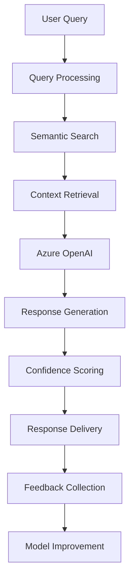

# AI-Powered FAQ & Knowledge Base Web Part

## Overview

The AI-Powered FAQ & Knowledge Base web part revolutionizes organizational knowledge management by combining traditional FAQ systems with advanced Azure AI capabilities. Built with React and Fluent UI, this intelligent solution provides automated answer generation, smart content suggestions, and seamless integration with Azure OpenAI services for enhanced user experience.

## Features

### Core Functionality
- **Intelligent FAQ Management**: Create, edit, and organize FAQ items with smart categorization
- **AI-Powered Answers**: Leverage Azure OpenAI for automated response generation
- **Smart Search**: Advanced search with AI-enhanced relevance scoring
- **Knowledge Base Articles**: Comprehensive article management with rich content support
- **Real-time Chat Interface**: Interactive AI assistant for immediate query resolution
- **Content Analytics**: Track usage patterns and optimize knowledge base effectiveness

### AI Integration Features
- **Azure OpenAI Integration**: Direct integration with GPT models for answer generation
- **Confidence Scoring**: AI confidence levels for generated responses
- **Smart Suggestions**: Automated content improvement recommendations
- **Semantic Search**: Context-aware search using AI embeddings
- **Auto-categorization**: Intelligent content classification and tagging
- **Continuous Learning**: AI model improvement through user feedback

### User Experience
- **Conversational Interface**: Chat-like experience for natural interactions
- **Multi-modal Search**: Text, voice, and natural language query support
- **Personalized Results**: User behavior-based result customization
- **Responsive Design**: Optimized for desktop, tablet, and mobile devices
- **Accessibility**: WCAG 2.1 compliant design with screen reader support
- **Multilingual Support**: Azure Cognitive Services for translation capabilities

### Integration Points
- **Azure OpenAI Services**: GPT-3.5/GPT-4 integration for answer generation
- **Azure Cognitive Search**: Enhanced search capabilities with AI indexing
- **Microsoft Graph**: User profile and organizational data integration
- **SharePoint Lists**: Native storage for FAQ and knowledge base content
- **Microsoft Teams**: Embedded bot integration and collaborative features
- **Power Platform**: Integration with Power Automate and Power BI for workflows

## Setup Instructions

### Prerequisites
- SharePoint Online environment with App Catalog access
- Azure OpenAI Service subscription and API keys
- SharePoint Framework (SPFx) 1.18.2 or higher
- Node.js 16.x or 18.x
- Azure Cognitive Services (optional for enhanced features)

### Azure OpenAI Setup

1. **Create Azure OpenAI Resource**
   ```bash
   # Using Azure CLI
   az cognitiveservices account create \
     --name myopenai \
     --resource-group myResourceGroup \
     --kind OpenAI \
     --sku s0 \
     --location eastus
   ```

2. **Deploy GPT Model**
   - Navigate to Azure OpenAI Studio
   - Create a deployment for GPT-3.5-turbo or GPT-4
   - Note the deployment name and endpoint URL

3. **Get API Keys**
   - Go to Azure OpenAI resource in Azure Portal
   - Navigate to "Keys and Endpoint"
   - Copy the API key and endpoint URL

### Installation Steps

1. **Deploy the Solution**
   ```bash
   npm install
   npm run build
   npm run package-solution
   ```

2. **Upload to App Catalog**
   - Navigate to SharePoint Admin Center
   - Go to More Features > Apps > App Catalog
   - Upload the `.sppkg` file from `sharepoint/solution/`

3. **Add to SharePoint Site**
   - Go to Site Contents > Add an App
   - Find "AI-Powered FAQ & Knowledge Base" and add it
   - Add the web part to pages using the web part picker

### Configuration

#### Web Part Properties
Configure the following properties in the web part property pane:

- **Description**: Customize the web part description
- **Azure OpenAI Endpoint**: Your Azure OpenAI service endpoint URL
- **Azure OpenAI API Key**: Your Azure OpenAI API key (store securely)
- **Enable AI Suggestions**: Toggle AI-powered content suggestions
- **Enable Analytics**: Toggle usage analytics and tracking

#### Azure AI Configuration
```typescript
// Example configuration
const azureAiConfig = {
  endpoint: "https://your-openai.openai.azure.com/",
  apiKey: "your-api-key-here",
  deploymentName: "gpt-35-turbo",
  apiVersion: "2023-12-01-preview"
};
```

#### SharePoint List Setup
The web part automatically creates these SharePoint lists:
- **FAQ Items**: Main FAQ content storage
- **Knowledge Base Articles**: Detailed articles and documentation
- **AI Responses**: Cached AI-generated responses for performance
- **Analytics Data**: User interaction and usage statistics
- **Content Categories**: Hierarchical categorization system

#### Permissions Configuration
- **Readers**: View FAQ and search content
- **Contributors**: Add and edit FAQ items and articles
- **AI Moderators**: Review and approve AI-generated content
- **Administrators**: Full access including AI configuration and analytics

## Usage Examples

### End User Workflow
1. **Search Interface**: Type questions in natural language
2. **AI Assistance**: Get instant AI-powered answers with confidence scores
3. **Browse Categories**: Explore organized content by topic
4. **Rate Responses**: Provide feedback to improve AI accuracy
5. **Suggest Content**: Recommend new FAQ items or improvements

### Content Creator Workflow
1. **Create FAQ Items**: Add questions and answers with categorization
2. **AI Enhancement**: Use AI suggestions to improve content quality
3. **Bulk Import**: Upload existing FAQ content from CSV or Excel
4. **Content Review**: Review and approve AI-generated responses
5. **Analytics Review**: Monitor content performance and user satisfaction

### Administrator Workflow
1. **AI Configuration**: Set up Azure OpenAI integration and parameters
2. **Content Moderation**: Review AI-generated content before publication
3. **Analytics Dashboard**: Monitor usage patterns and system performance
4. **Model Training**: Fine-tune AI responses based on user feedback
5. **Security Management**: Control access and API key rotation

## Teams Integration

### Bot Integration
The web part can be configured as a Teams bot for seamless integration:

```typescript
// Teams bot configuration
const teamsBot = {
  botId: "your-bot-id",
  capabilities: ["chat", "search", "suggestions"],
  channels: ["general", "support", "hr"]
};
```

### Teams-Specific Features
- **Channel Integration**: Add FAQ bot to specific Teams channels
- **Proactive Notifications**: Send updates about new content
- **Adaptive Cards**: Rich card responses with interactive elements
- **Meeting Integration**: FAQ access during Teams meetings
- **Mobile Support**: Full functionality through Teams mobile app

### Installation in Teams
1. **Package for Teams**: Use the included Teams manifest
2. **Upload to Teams**: Add as custom app in Teams admin center
3. **Configure Permissions**: Set appropriate bot permissions
4. **Deploy to Users**: Make available to specific users or organization-wide

## Technical Architecture

### Frontend Components
- **AiPoweredFaq.tsx**: Main React component with search and chat interfaces
- **SearchInterface.tsx**: Advanced search with filters and AI suggestions
- **ChatBot.tsx**: Conversational AI interface for natural interactions
- **FaqPanel.tsx**: Detailed view for FAQ items with related content
- **AnalyticsDashboard.tsx**: Usage statistics and performance metrics
- **ContentEditor.tsx**: Rich text editor for creating and editing content

### Data Models
- **IFaqItem**: Complete FAQ item structure with AI metadata
- **IKnowledgeBaseArticle**: Rich article content with attachments
- **IChatMessage**: Conversation history and AI response tracking
- **IAiSuggestion**: AI-generated content improvement suggestions
- **IAnalytics**: Usage tracking and performance metrics

### Services
- **AzureAiService**: Azure OpenAI integration and response processing
- **FaqDataService**: SharePoint data operations and caching
- **SearchService**: Enhanced search with AI-powered relevance
- **AnalyticsService**: Usage tracking and performance monitoring
- **CacheService**: Response caching for improved performance

### AI Processing Pipeline


## Advanced AI Features

### Smart Content Generation
- **Auto-FAQ Creation**: Generate FAQ items from support tickets
- **Content Summarization**: Create summaries of long documents
- **Multi-language Support**: Automatic translation of content
- **Tone Adaptation**: Adjust response tone based on context

### Intelligent Analytics
- **Usage Pattern Analysis**: Identify knowledge gaps and popular topics
- **Content Performance**: Track FAQ effectiveness and user satisfaction
- **AI Accuracy Monitoring**: Monitor and improve AI response quality
- **Predictive Insights**: Anticipate user needs and content requirements

### Continuous Improvement
- **Feedback Loop**: User ratings improve AI model accuracy
- **A/B Testing**: Test different response formats and styles
- **Performance Optimization**: Cache frequently accessed content
- **Model Fine-tuning**: Customize AI responses for organizational context

## Customization Options

### AI Model Customization
```typescript
// Custom AI prompts and behavior
const customPrompts = {
  systemPrompt: "You are a helpful assistant for [Company Name]. Provide accurate, friendly responses based on company policies.",
  temperatureSettings: {
    factual: 0.2,    // Low creativity for factual content
    creative: 0.7,   // Higher creativity for explanations
    conversational: 0.5  // Balanced for chat interactions
  }
};
```

### UI Customization
- **Branding**: Apply organizational colors, logos, and styling
- **Layout Options**: Configure search, chat, and browse interfaces
- **Component Visibility**: Show/hide features based on user roles
- **Custom Themes**: Create custom Fluent UI themes

### Business Logic Extensions
- **Custom Categories**: Define organization-specific content categories
- **Approval Workflows**: Implement custom content review processes
- **Integration APIs**: Connect to external knowledge management systems
- **Custom Analytics**: Add organization-specific tracking metrics

## Security and Compliance

### Data Protection
- **API Key Security**: Secure storage and rotation of Azure API keys
- **Content Encryption**: Encrypt sensitive content at rest and in transit
- **Access Control**: Role-based permissions for content and AI features
- **Audit Logging**: Complete audit trail for AI interactions and content changes

### Compliance Features
- **GDPR Compliance**: Data subject rights and privacy controls
- **Content Moderation**: AI-powered content filtering and moderation
- **Retention Policies**: Automated content lifecycle management
- **Regulatory Reporting**: Generate compliance reports and audit trails

### AI Governance
- **Response Monitoring**: Track AI responses for accuracy and appropriateness
- **Bias Detection**: Monitor for potential AI bias in responses
- **Content Guidelines**: Ensure AI responses align with organizational policies
- **Human Oversight**: Human review processes for AI-generated content

## Performance Optimization

### Caching Strategy
- **Response Caching**: Cache AI responses to reduce API calls
- **Content Delivery**: CDN optimization for media and attachments
- **Search Indexing**: Optimized search indexes for fast retrieval
- **Load Balancing**: Distribute AI processing loads effectively

### Scalability Considerations
- **API Rate Limiting**: Manage Azure OpenAI API usage and costs
- **Content Sharding**: Partition large knowledge bases for performance
- **Async Processing**: Background processing for content analysis
- **Resource Monitoring**: Track and optimize Azure resource usage

## Troubleshooting

### Common Issues
1. **AI Service Errors**: Check Azure OpenAI service status and API keys
2. **Slow Response Times**: Review caching configuration and API rate limits
3. **Inaccurate Responses**: Adjust AI model parameters and training data
4. **Permission Issues**: Verify SharePoint permissions and Azure AD configuration

### Debugging Tools
- **AI Response Inspector**: View AI response metadata and confidence scores
- **Search Analytics**: Monitor search performance and relevance
- **Error Logging**: Comprehensive error tracking and reporting
- **Performance Metrics**: Real-time performance monitoring dashboard

### Support Resources
- Azure OpenAI documentation and best practices
- SharePoint Framework development guides
- Microsoft Graph API documentation
- Azure Cognitive Services integration guides

## Future Enhancements

### Planned AI Features
- **Advanced RAG (Retrieval-Augmented Generation)**: Enhanced context retrieval
- **Multi-modal AI**: Support for image and document analysis
- **Conversational Memory**: Maintain context across chat sessions
- **Custom Model Training**: Organization-specific AI model fine-tuning

### Integration Roadmap
- **Power Virtual Agents**: Integration with Microsoft's bot framework
- **Viva Connections**: Native integration with Microsoft Viva suite
- **Microsoft Copilot**: Integration with Microsoft 365 Copilot
- **Third-party AI Services**: Support for additional AI providers

### Advanced Analytics
- **Predictive Analytics**: Forecast content needs and user behavior
- **Sentiment Analysis**: Monitor user satisfaction and content effectiveness
- **Knowledge Gap Analysis**: Identify missing content opportunities
- **ROI Measurement**: Track knowledge base business impact

## Cost Management

### Azure OpenAI Costs
- **Token Usage Monitoring**: Track API usage and optimize costs
- **Caching Strategy**: Reduce API calls through intelligent caching
- **Response Optimization**: Balance response quality with cost efficiency
- **Budget Alerts**: Set up cost monitoring and alerts

### Performance vs. Cost
- **Model Selection**: Choose appropriate AI models for different scenarios
- **Response Length**: Optimize response length for cost and quality
- **Frequency Limits**: Implement usage limits to control costs
- **Batch Processing**: Process multiple queries efficiently

## Contributing

To contribute to this web part:
1. Fork the repository and create a feature branch
2. Follow TypeScript and React best practices
3. Include comprehensive testing for AI features
4. Test with actual Azure OpenAI services
5. Document new features and configuration options
6. Submit pull request with detailed description and test results

### Development Guidelines
- Use proper error handling for AI service calls
- Implement comprehensive logging for debugging
- Follow accessibility guidelines for AI interfaces
- Create meaningful test data for AI scenarios
- Document AI prompt engineering decisions

## License

This project is licensed under the MIT License - see the LICENSE file for details.

## Disclaimer

This web part integrates with Azure OpenAI services. Users are responsible for:
- Managing Azure OpenAI service costs and usage
- Ensuring compliance with Azure OpenAI terms of service
- Monitoring AI responses for accuracy and appropriateness
- Implementing appropriate content moderation and governance policies